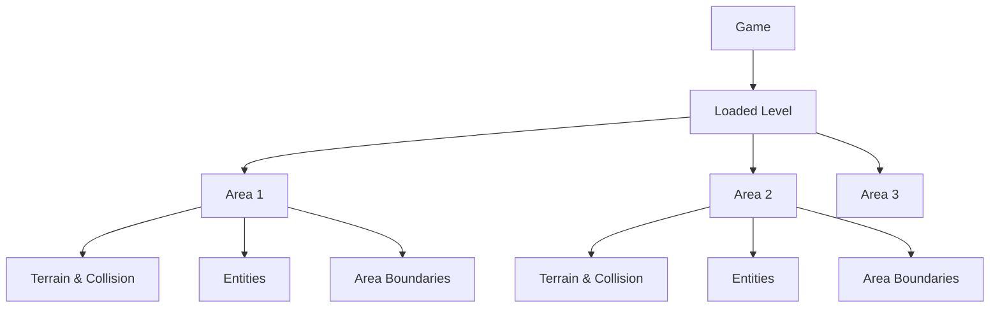
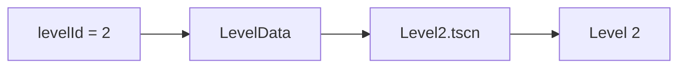
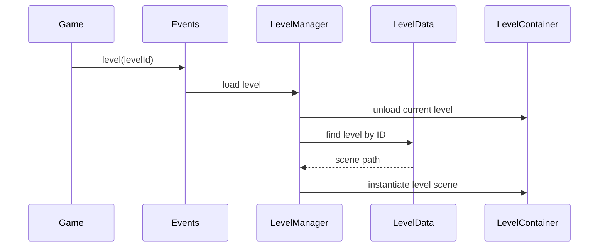
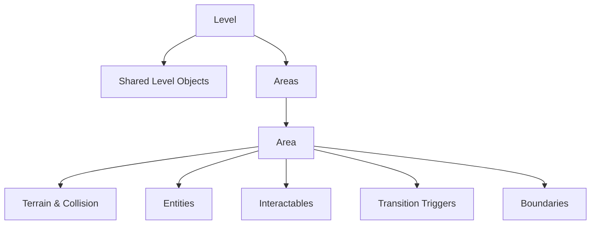
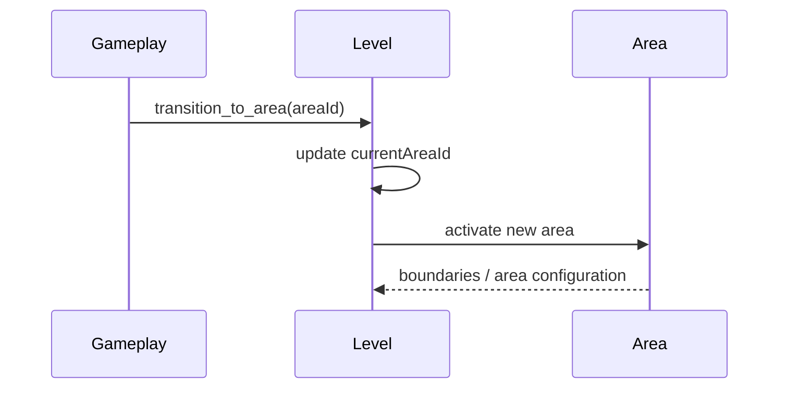
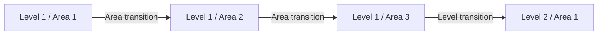

# Level Management

This document describes how levels and areas are structured and managed.

The system separates **level selection**, **level loading**, and **area structure**. Gameplay systems request a level or area by ID and should not need to know where scenes are stored or how they are instantiated.

## Structure

The world is organized as:



A **Level** is a complete playable scene.

An **Area** is a section within that level. Moving between areas does not load another level; the existing level remains active.

---

## LevelData

Levels are registered using `LevelData`.

`LevelData` connects a stable `levelId` to the scene representing that level.



This allows gameplay to request:

```gdscript
level(2)
```

without knowing the scene path.

The level scene itself uses the same `levelId`, allowing it to resolve its own metadata after being instantiated.

---

## Loading Levels

A level change is requested through the global:

```gdscript
level(levelId)
```

signal.

The level manager owns the lifecycle of the loaded level.



Only one level is active at a time.

Levels are instantiated underneath a persistent `LevelContainer`. This allows systems outside the level, such as UI, multiplayer/session state and global managers, to survive level changes.

---

## Areas

Every level contains an `Areas` container.

```text
Level
├── Player / shared objects
├── Camera
└── Areas
	├── Area
	│   └── areaId = 1
	├── Area
	│   └── areaId = 2
	└── Area
		└── areaId = 3
```

Each area has a unique `areaId` **within its level**.

The level keeps track of the current area through `currentAreaId`. This allows other systems to retrieve the active area without knowing its location in the scene tree.

Area IDs may be reused between levels:

```text
Level 1 / Area 1
Level 1 / Area 2

Level 2 / Area 1
Level 2 / Area 2
```

The logical identity of an area is therefore effectively:

```text
levelId + areaId
```

---

## Area Responsibilities

An area represents a self-contained section of gameplay.

An area owns the content that belongs specifically to that section of the level, such as:

```text
Area
├── Terrain
├── Collision
├── Entities
├── Interactables
├── Transition Triggers
└── Boundaries
```

An area needs **boundaries** describing its physical extent. These can be used by systems such as the camera, spawning, player constraints and transitions.

Objects that exist for the entire level belong to the **Level** rather than an individual Area.

This gives the ownership model:



---

## Area Transitions

Changing areas is different from changing levels.

An area change is requested through:

```gdscript
transition_to_area(areaId)
```

The existing level remains loaded and its `currentAreaId` changes.



An area transition can then drive behaviour such as camera movement, player positioning, background changes or activation of area-specific gameplay.

---

## Level vs Area

The important distinction is:



**Area transition**

Keeps the current level loaded and changes the active section.

**Level transition**

Unloads the current level and instantiates another level scene.

---

## Creating Levels and Areas

A new level consists conceptually of:

```text
LevelData
	│
	└── levelId + scene path
			  │
			  ▼
		 Level Scene
			  │
			  └── Areas
				   ├── Area 1
				   ├── Area 2
				   └── ...
```

The level scene and its `LevelData` share the same `levelId`.

Each level starts in an initial area, conventionally `areaId = 1`.

Additional areas are children of the level's `Areas` container and receive their own unique `areaId`.

The resulting design keeps references stable and avoids coupling gameplay code to scene paths or node names:

```text
Gameplay
   │
   ├── level(levelId)
   │
   └── transition_to_area(areaId)
             │
             ▼
       Level Management
             │
             ▼
      Godot Scene Tree
```

The central rule is:

> **Gameplay chooses where to go. Level management decides how that level or area is represented and activated.**
