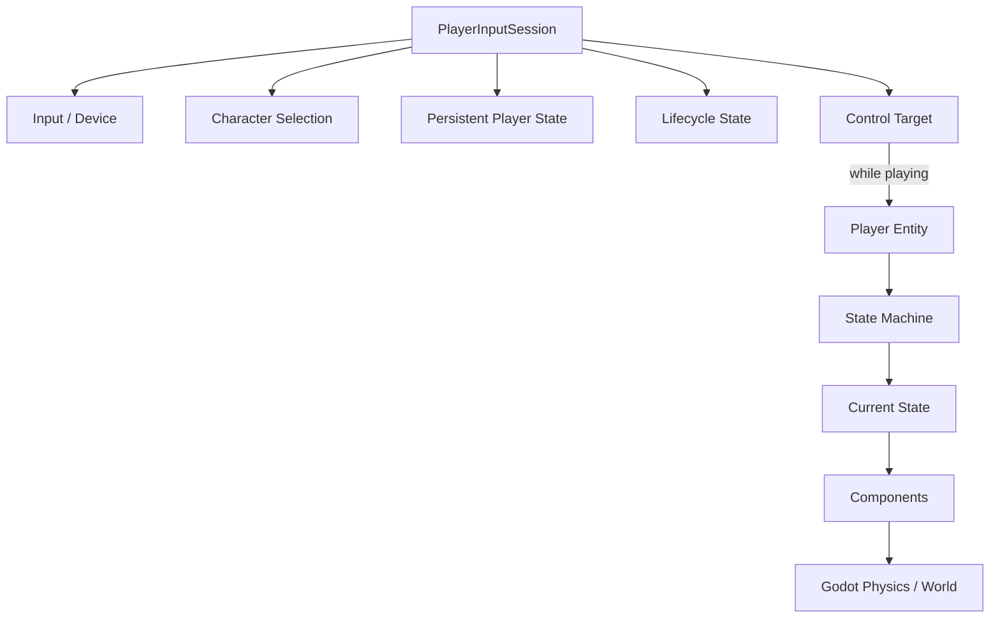
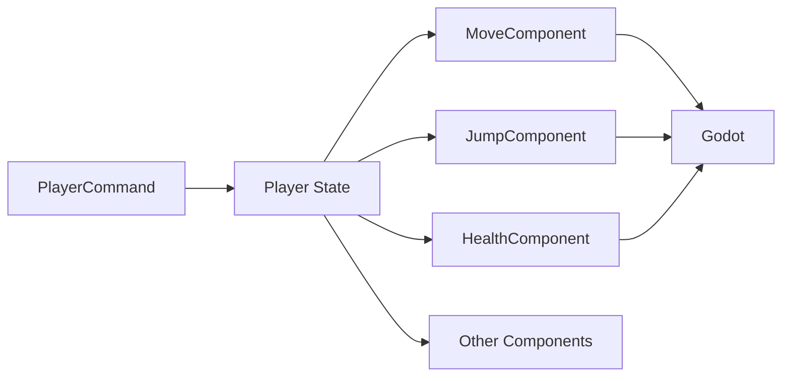
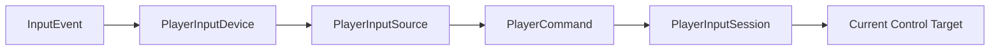
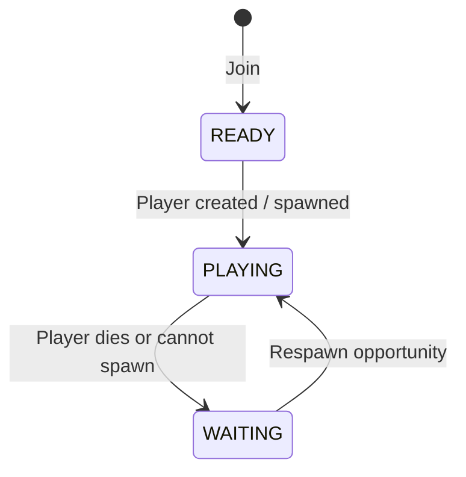
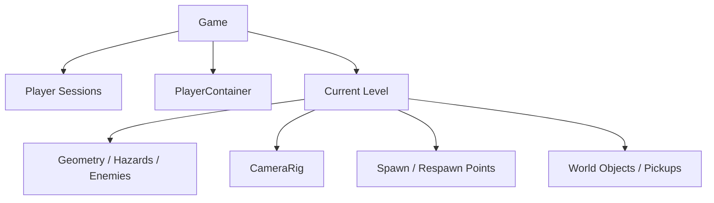
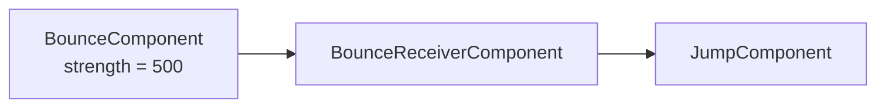
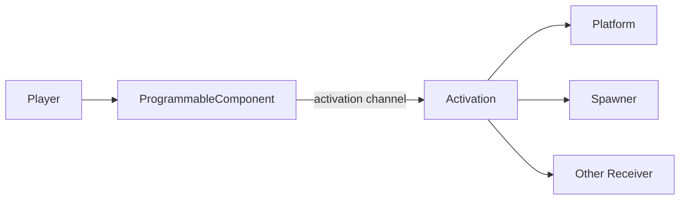
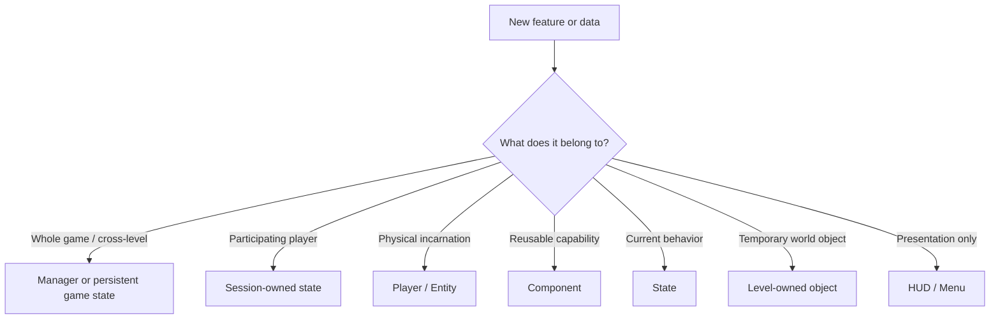

# PCM Tower Climb

PCM Tower Climb is a local multiplayer 2D tower-climbing platformer built in Godot 4. Up to four players can join with independent input devices, climb through shared levels, interact with programmable world objects, and compete while still depending on each other to progress.

The project is intentionally built around a small set of architectural ideas rather than putting gameplay logic directly into scene scripts. The main goal is to keep features easy to extend without turning the player, level, or `Main` into a central dependency for everything.

## Architecture at a glance

The most important distinction is between a **participant in the game** and their current **physical Player entity**.

A session survives death and respawning. The `Player` does not have to.

```mermaid
flowchart TD
	S[PlayerInputSession] --> I[Input / Device]
	S --> C[Character Selection]
	S --> P[Persistent Player State]
	S --> L[Lifecycle State]
	S --> T[Control Target]

	T -->|while playing| E[Player Entity]

	E --> SM[State Machine]
	SM --> ST[Current State]
	ST --> CO[Components]
	CO --> G[Godot Physics / World]
```

This separation allows a participant to remain in the game while their physical entity is removed, for example after falling into a death zone. A fresh `Player` can later be created for the same session without losing character selection, input ownership, fragments, score, or other persistent run state.

The current implementation uses `PlayerInputSession` for this broader session role. If persistent player responsibilities continue to grow, input may eventually become one concern of a more general `PlayerSession`, but that refactor should be driven by an actual need rather than naming alone.

## Gameplay design

### Entities, states and components

Gameplay entities are built through composition.

```mermaid
flowchart LR
	CMD[PlayerCommand] --> STATE[Player State]
	STATE --> MOVE[MoveComponent]
	STATE --> JUMP[JumpComponent]
	STATE --> HEALTH[HealthComponent]
	STATE --> OTHER[Other Components]
	MOVE --> ENGINE[Godot]
	JUMP --> ENGINE
	HEALTH --> ENGINE
```

The responsibilities are deliberately different:

- **Entity** — what exists in the world.
- **State** — what the entity is currently doing and which transitions are valid.
- **Component** — a focused capability the entity can use.
- **Godot** — physics, collisions, scene lifecycle, rendering, and other engine mechanics.

States coordinate capabilities; they should not reimplement them. Components should remain focused and reusable instead of deciding the complete behavior of an entity.

Composition is preferred over increasingly specialized inheritance. A bouncing surface, for example, supplies its bounce strength through a component; the Player only needs the capability to receive and apply that bounce.

### Input and control

Physical input is kept separate from gameplay behavior.

```mermaid
flowchart LR
	EVENT[InputEvent] --> DEVICE[PlayerInputDevice]
	DEVICE --> SOURCE[PlayerInputSource]
	SOURCE --> COMMAND[PlayerCommand]
	COMMAND --> SESSION[PlayerInputSession]
	SESSION --> TARGET[Current Control Target]
```

This lets each local player have an independent device and allows control to temporarily move to another object without changing who owns the device. Gameplay entities work with semantic commands such as move, jump, or interact rather than keyboard or controller events.

### Player lifecycle

Joining the game, having a Player entity, and being physically present in a level are related but separate concepts.

```mermaid
stateDiagram-v2
	[*] --> READY: Join
	READY --> PLAYING: Player created / spawned
	PLAYING --> WAITING: Player dies or cannot spawn
	WAITING --> PLAYING: Respawn opportunity
```

`PlayerLifecycleManager` coordinates this lifecycle. `SpawnManager` handles creating, positioning, tracking, and removing the physical Player entities.

A useful ownership rule is:

> If something must survive destruction of the Player entity, it does not belong on the Player.

Position, velocity, current health, collisions, animation and state-machine state belong to the physical entity. Character choice, input ownership, collected fragments, score and similar run state belong to the persistent participant/session side.

### Levels and the world

Players and levels have different lifetimes.

```mermaid
flowchart TD
	GAME[Game] --> SESSIONS[Player Sessions]
	GAME --> PLAYERS[PlayerContainer]
	GAME --> LEVEL[Current Level]

	LEVEL --> WORLD[Geometry / Hazards / Enemies]
	LEVEL --> CAMERA[CameraRig]
	LEVEL --> SPAWNS[Spawn / Respawn Points]
	LEVEL --> OBJECTS[World Objects / Pickups]
```

A level owns its temporary world: geometry, enemies, hazards, camera boundaries, programmable objects, spawn locations, and world collectibles. Persistent participant state lives outside that world.

`LevelManager` changes the active environment. The shared `CameraRig` belongs to that environment and tracks whichever Player entities are currently active.

### Interactions

Interactions should express who **provides** a mechanic and who **receives** it instead of putting object-specific knowledge into the Player.

For example:

```mermaid
flowchart LR
	SURFACE[BounceComponent<br/>strength = 500] --> RECEIVER[BounceReceiverComponent]
	RECEIVER --> JUMP[JumpComponent]
```

Programming follows the same loose-coupling principle. A Player can program a source, which activates a channel; matching receivers decide what that activation means.

```mermaid
flowchart LR
	PLAYER[Player] --> PROGRAM[ProgrammableComponent]
	PROGRAM -->|activation channel| EVENT[Activation]
	EVENT --> PLATFORM[Platform]
	EVENT --> SPAWNER[Spawner]
	EVENT --> OTHER[Other Receiver]
```

The source and receiver do not need direct references to one another. This allows switches, respawn systems, platforms, spawners, and future programmable objects to reuse the same interaction model.

## Managers and communication

Managers are used for responsibilities whose lifetime or coordination extends beyond a single entity. Examples include game flow, sessions, player lifecycle, spawning, levels, music, and sound effects.

They should not become a default location for gameplay logic. A mechanic that naturally belongs to an entity, state, component, or level object should stay there.

Likewise, global events are useful when systems genuinely need to remain decoupled, but they are not a replacement for normal dependencies. Prefer a direct call when one object clearly owns or composes another; prefer signals/events for meaningful occurrences across ownership boundaries or when multiple independent systems may react.

## Adding a feature

Before deciding which script to modify, first decide **who owns the feature and how long it lives**.

```mermaid
flowchart TD
	F[New feature or data] --> Q{What does it belong to?}
	Q -->|Whole game / cross-level| M[Manager or persistent game state]
	Q -->|Participating player| S[Session-owned state]
	Q -->|Physical incarnation| E[Player / Entity]
	Q -->|Reusable capability| C[Component]
	Q -->|Current behavior| ST[State]
	Q -->|Temporary world object| W[Level-owned object]
	Q -->|Presentation only| UI[HUD / Menu]
```

A few questions catch most architectural mistakes early:

- Should this survive Player death and recreation?
- Should it survive a level change?
- Is this a capability or a temporary behavioral state?
- Who provides the mechanic, and who receives it?
- Is the dependency local, or does it cross system/lifetime boundaries?
- Does the design still work with several players joining, dying, and respawning independently?
- Is there already an abstraction that owns this responsibility?

Prefer the smallest change that fits these boundaries. Avoid introducing generic systems before a concrete feature needs them, and avoid solving a local mechanic by adding another global manager.

## Development approach

When extending or debugging the game, follow the existing execution path before redesigning it. Make changes incrementally, verify multiplayer and lifecycle transitions, and keep unrelated refactors separate.

The architecture is intended to evolve with the game. The important part is not preserving every current class forever, but preserving clear ownership between **persistent participants, disposable world entities, behavioral states, reusable capabilities, temporary level state, orchestration, and presentation**.

For implementation-specific rules and guidance for coding agents, see [`AGENTS.md`](./AGENTS.md).
